# KogniJS - Animate [](https://travis-ci.org/aleneum/kognijs-animate) [](https://coveralls.io/github/aleneum/kognijs-animate?branch=master)


Support the creation of reusable customized user interface elements based on SVG (using [Snap.svg](http://snapsvg.io/))
and all the goodies modern web technology has to offer.
In combination with the [rsb](https://github.com/aleneum/kognijs-rsb) and [ui](https://github.com/aleneum/kognijs-ui)
module of the KogniJS framework, developers can couple interface behaviour directly to a smart environment's system state.
It also contains helpers for projecting Browser-based GUIs onto flat surfaces to support Spatial Augmented Reality
and interactive workspaces.

## Table of Contents

* [Getting Started](#started)
  - [NPM](#npm)
  - [Bower or CDN](#bower)
* [Custom animations in 7 steps](#animations)
* [Projection and calibration](#projection)
* [Interactive Demo](#demo)
* [Feedback and Contribution](#feedback)

## <a name="start"></a>Getting Started

### <a name="npm"></a>NPM

```shell
npm install kognijs-animate
```

In your javascript file require the module and create an instance to be used:

```javascript
var Animate = require('kognijs-animate');
```

### <a name="bower"></a>Bower or CDN

```shell
bower install kognijs-animate
```

You can include kognijs-animate directly in your HTML file:

```html
<script src="https://cdn.rawgit.com/aleneum/kognijs-animate/v0.1.2/redist/kognijs.animate.min.js"></script>
```

The `Animate` factory resides in the *KogniJS* namespace:

```javascript
var Animate = KogniJS.Animate;
```

## <a name="animations"></a>Animations in 7 steps

Animations are always created with the help of the `Animate` factory.

#### Animate.createElement(*svgPath*, *options*, *callback*)

Animations are conceptually split into two components: a) the SVG graphical data and b) configuration and code.
The path to the SVG data is passed as `svgPath`. The rest is wrapped into a JSON `options` argument.

### Step 01 - Loading an SVG

Loading SVGs is straightforward. A path to an SVG is passed and in the options object we define the SVG parent
of the created fragment. If no `parent` is passed, a new SVG object will be created and added to the DOM.
In this case an `id` parameter with a unique ID should be passed to `createElement`. The (optional) `callback` is called when
object creation is done and the object can savely be used.

```javascript
var animation;
Animate.createElement('data/step01.svg', {parent:'step01'}, function(anim) {animation = anim});
```
| Result | SVG Structure |
|:------:|--------------:|
| 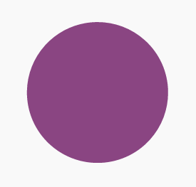 | 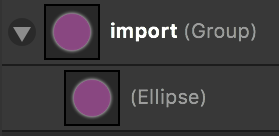 |

What is special about the SVG structure is that we require a group named *import* in the SVG structure.
*Only elements residing within this group will be visible*.

### Step 02 - Paths and Loops

SVG paths can be used to animate SVG elements. This is done by passing dictionaries as a `loop` argument
within `options`:

```javascript
var options02 = {parent:'step02', loops:[{element:'circle', path:'circlePath', duration:5000}]};
Animate.createElement('data/step02.svg', options02);
```

| Result | SVG Structure |
|:------:|--------------:|
| 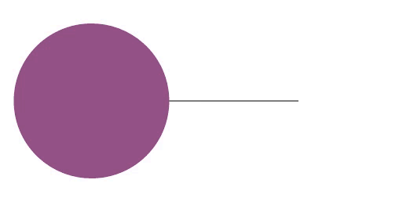 | 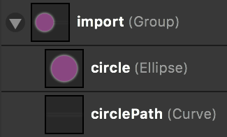 |

*element* is the name of the object to be moved and *path* the name of the path to move along. *duration* is passed
in milliseconds.
Animations are started on creation time but can be paused, continued or stopped. These functions are part of the `Animation` object.

```javascript
animation.pause(); // pauses the animation but saves the last state
animation.start(); // continues the animation
animation.stop(); // stops the animation
animation.start(); // starts the animation from the beginning.
```

### Step 03 - Purpose of the import group

`Animate` only import SVG elements within the `import` group. This allows to separate paths which are only used
for animations from the actual animated object. In the example below `circlePath` will be used for animation purposes
but will not be visible in the final SVG.

```javascript
var options03 = {parent:'step03', loops:[{element:'circle', path:'circlePath', duration:5000}]};
Animate.createElement('data/step03.svg', options03);
```

| Result | SVG Structure |
|:------:|--------------:|
| 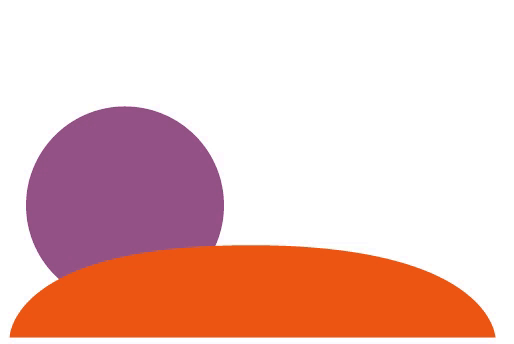 | 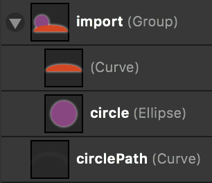 |

### Step 04 - Masks

All elements containing a `mask_` prefix will be considered masks for a certain element.
For instance, `mask_circle` will be imported as a mask for the element circle.
Like other elements, masks can also be moved along paths. In the case below, case circle and its mask are moved
along `circlePath` while the mask for the whole group (`mask_circleGroup`) is static.

```javascript
var options04 = {parent:'step04', loops:[{element:'circle', path:'circlePath', duration:5000}]};
Animate.createElement('data/step04.svg', options04);
```

| Result | SVG Structure |
|:------:|--------------:|
| 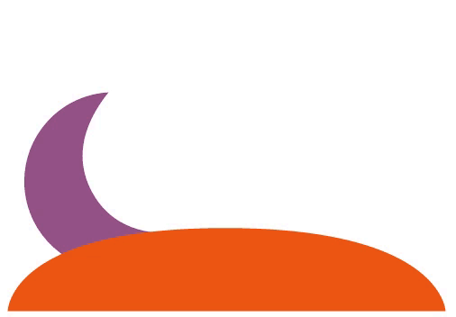 | 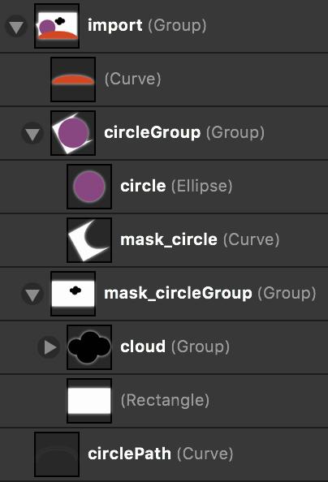 |

### Step 05 - Variable Binding

The actual purpose of `Animate` is to allow GUI elements to represent a system's state.
Therefore, elements need to be connected to model variables.
This can be done with variable `maps`.
A map contains variables as dictionary keys and the coupled elements as an array.
Text content can be mapped easily by just passing the name of the variable.
In the case below, we create a `time` variable which is mapped to our SVG element which is also called *time*.
Additionally, we map the variable `progress` to the circle's movement along `circlePath`.
The progress will be mapped from 0 (beginning of the path) to 1 (end of the path).
The value of the variables can be altered with the `Animation.set(variableName, value)` method.

```javascript
var options05 = {parent: 'step05', map: {'time':['time'], 'progress': [{element:'circle', path:'circlePath'}]}};
Animate.createElement('data/step05.svg', options05, function(anim) {
  window.step05 = anim;
  step05.set('time', "12:34");
  step05.set('progress', 0.9);
});
```

| Result | SVG Structure |
|:------:|--------------:|
| 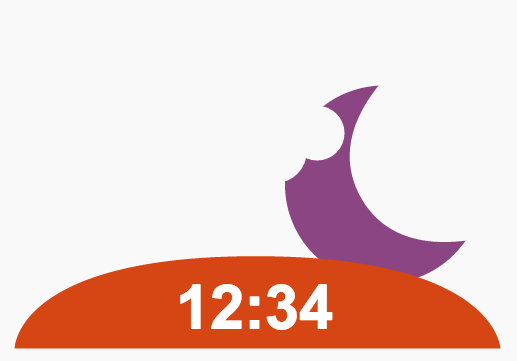 | 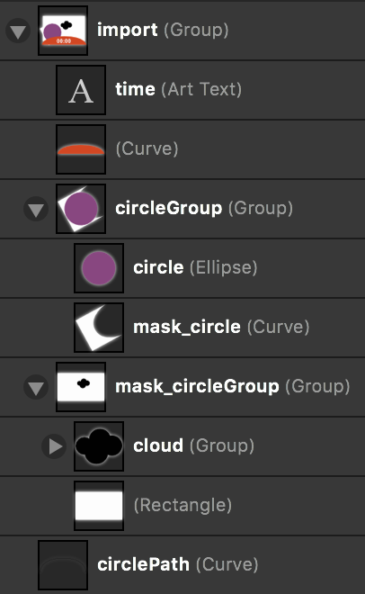 |

### Step 06 - Code Snippets

In cases where variables cannot be mapped directly to output, code snippets can be passed as strings.
`Animate` will convert these strings into functions and wrap variable declarations for convenience.

```javascript
var snippet = "var t = newVal.split(model.sep);" +
              "var p = (parseInt(t[0]) * 60 + parseInt(t[1]) + 360) % 1440 / 720;" +
              "this.set('progress', p);";

var options06 = {parent: 'step06', map: {
  progress: [{element:'circle', path:'circlePath'}],
  time: [
    'time',
    {do: snippet, model:{sep:':'}}
  ]
}};

Animate.createElement('data/step05.svg', options06, function(anim) {
  window.step06 = anim;
  step06.set('time', '04:45');
});
```

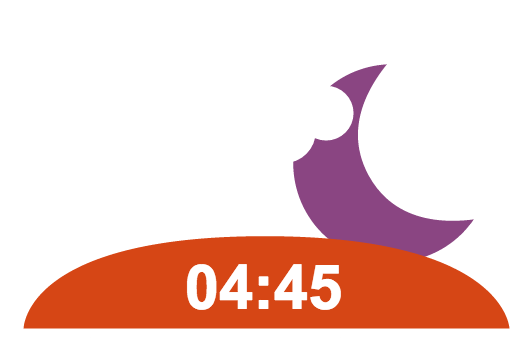

Whenever `animation.set('time', newValue)` is called now, the snippet will be executed. *this* refers to the `Animation`
object.

### Step 07 - CSS Styling

While global css can be used for SVGs as well, it is also possible to attach custom css styling to `Animation` objects.
This is intended to increase reuse value of 'packaged' animations.
This can be used to realize gradients and color shifts, based on the state of variables.
It is also worth mentioning, that imported elements will be renamed to `id_elementName`.
This means, `circle` will be attached as `step07_circle` to allow multiple imports of the same SVGs and also prevent
name collisions.

```javascript
var style = "@keyframes circleAnimation {0% {fill: #8A4582} 50% {fill: #8A7645} 100% {fill: #8A4582}}\n" +
  "#circle { animation-name: circleAnimation; animation-duration: 1s; animation-play-state: paused;}\n" +
  "#time {text-align: center;}";

var options07 = {parent: 'step07', style: style, map: {
  progress: [{element:'circle', path:'circlePath'}],
  time: [
    'time',
    { do: snippet + "circle.attr({style: 'animation-delay:-' + p + 's;'});\n",
      model:{sep:':'}, resolve: ['circle']}
  ]
}};

var times = ['18:21', '19:45', '21:17', '23:41', '1:19', '2:01','3:33', '5:11'];
var idx = 0;

KogniJS.Animate.createElement('data/step05.svg', options07, function(anim) {
  setInterval(function() {idx = (idx + 1) % times.length; step07.set('time', times[idx]);}, 300);
});

```

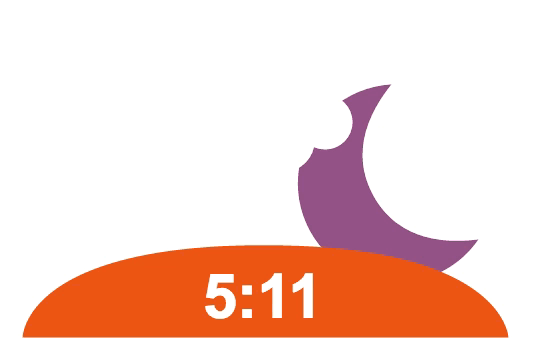

CSS `text-align` is not directly applied to SVG elements. `Animate` uses this information to realign elements after they
have been imported.
Manual alignment (or through code snippets) can be conducted with `Animate.align(elementName, alignment)` where alignment
can either be 'start', 'middle' or 'end'.

## <a name="projection"></a>Projection

If you plan to project your GUI onto a surface, the `Projection` module of `Animate` can do two things for you:

* map world coordinates to screen coordinates
* apply the projection matrix onto a canvas and an SVG overlay

This allows to use canvas libraries such as [fabric](http://fabricjs.com/), [pixi](http://www.pixijs.com/)
or [paper](http://paperjs.org/) as you are used to.

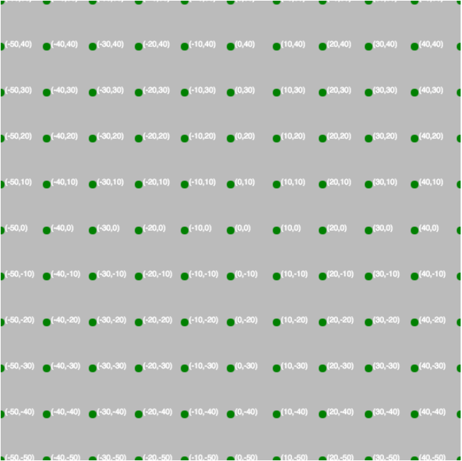

```
var defaultConfig = {
      matrix: "1, 0, 0, 0,  0, 1, 0, 0,  0, 0, 1, 0,  0, 0, 0, 1",
      surface: { width: 100, height: 100, origin: { x: 0.5, y: 0.5 }},
      screen: {width: 600, height: 600}
    };

var defaultCanvas = Animate.createProjection('exampleCanvas', defaultConfig);
defaultCanvas.showCoords();
```

In this case we use an identity matrix, but map the surface dimensions (100mm x 100mm) to the screen resolution of
the element (600px x 600px).
Also we altered the center of origin from the common for screens top-left position to a center point.
It also changes the coordinate system from left-handed (x left; y down) to right-handed (x left; y up).

### Calibration

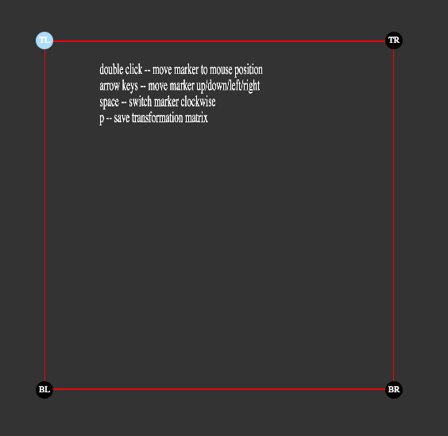

Calibration is done by dragging all points to the edges of the projection surface.
Double click sets the initial points which can be adjusted with arrow keys.
Space cycles through the edges.
`p` saves the current projection matrix into the `LocalStorage` object of the browser as 'matrix'.

#### Result

With `preferCachedMatrix`, the projection can be configured to try to load a matrix from the local storage.
If no matrix is found, the backup matrix passed as `matrix` will be used.

```javascript
var calibratedConfig = {
  matrix: "0.829438, 0.071225, 0, 0.000103098, 0.0596609, 0.50144, 0, -0.000173317, 0, 0, 1, 0, 25, 22, 0, 1",
  preferCachedMatrix: true,
  surface: { width: 100, height: 100, origin: { x: 0.5, y: 0.5 }},
  screen: { width: 600, height: 600}
};

var calibratedCanvas = KogniJS.Animate.createProjection('calibratedCanvas', calibratedConfig);
calibratedCanvas.showCoords();
```

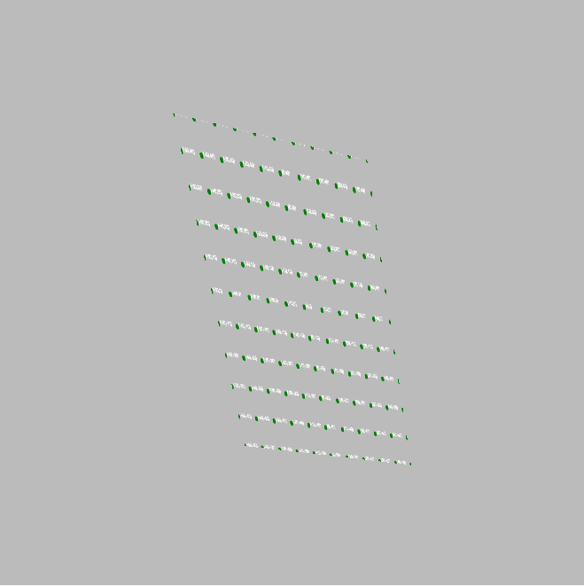

## <a name="demo"></a>Interactive Demo

An interactive demo can be started with npm and gulp:

```
git clone https://github.com/aleneum/kognijs-animate.git
cd kognijs-animate
npm install -g gulp # if you havent done already
npm install # install all dependencies
gulp server
```

Open the [tour](http://localhost:3000/tour.html) in your favourite browser.

## <a name="feedback"></a>Feedback and Contribution

This library is under constant development and will be altered regularly.
It is part of the research collaboration project [KogniHome](kogni-home.de) and serves mainly to solve issues
arising within this project.
However, feel free to open issues, provide feedback about design decisions of file pull requests.
Every kind of support is appreciated.
